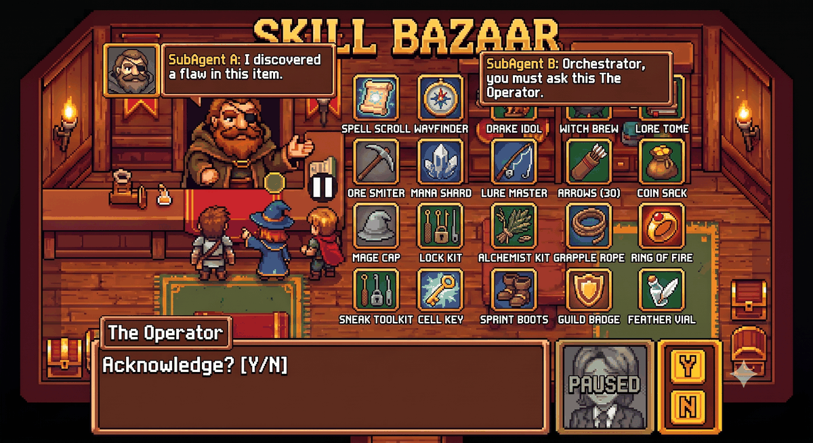

# agent-delegation

<p align="center">
  
</p>

A protocol for handing work to a subagent that cannot ask the human mid-run. The skill itself
is [`SKILL.md`](SKILL.md), written for the agent. This file is for the human: what the skill
does, how to install it, why it says what it says, and what is known about the harnesses it
runs on. The agent loads `SKILL.md` alone, and nothing in it points here, so this file costs
no context at use time.

## What it does

Delegating a self-contained work item to a background subagent keeps the main session's
context clean, and lets the subagent start without the parent's irrelevant history. Two walls
make naive delegation fail, and the skill is built around them.

1. **A background subagent has no direct channel to the human.** Handed an ambiguous spec, it
   guesses, and the guess is written to disk by the time anyone sees it. Some harnesses give
   the subagent a channel to its *parent* session. That channel is a relay, not a human: the
   question travels subagent to parent to human to parent to subagent, and each hop costs a
   turn.
2. **Privilege boundaries return success on refusal.** An action that needs interactive human
   consent, such as a GUI elevation prompt, can return a success exit code whether the human
   approved, denied, or never looked. An agent that trusts the exit code reports success for
   work that never happened.

The skill answers with five rules: delegate by default with two carve-outs (secret values,
and the step that needs the human at the screen), a decision-completeness gate before the
spawn, a pause clause in every delegation prompt so a subagent that hits an open decision
keeps its context and gets resumed instead of guessing, evidence named instead of commands,
and artifact verification instead of exit codes.

## The flow

The case the skill is built around: a subagent that has done real work and holds real
context, blocked by one open decision. Time runs downward.

```
 human            parent (main session)                 subagent
   |                     |                                  |
   |  "do X"             |                                  |
   |-------------------->|                                  |
   |                     |  gate: every decision resolved?  |
   |                     |  spec + pause clause             |
   |                     |---- spawn ---------------------->|
   |                     |                                  |  reads files, runs checks,
   |                     |                                  |  edits 4 of 5 files  } context
   |                     |                                  |  ...hits decision D  } worth
   |                     |                                  |     spec is silent   } keeping
   |                     |                                  |  does the parts free of D
   |                     |                                  |  leaves the D part untouched
   |                     |<--- report: done 4/5, D open, ---|  PAUSE (context intact)
   |                     |     files touched: a b c d       |
   |                     |                                  |
   |                     |  answer from own context?        |
   |  AskUserQuestion D  |  no: forward, record the pause   |
   |<--------------------|                                  |
   |  "D = b"            |                                  |
   |-------------------->|                                  |
   |                     |---- SendMessage(agent, "D=b") -->|  RESUME (same transcript)
   |                     |                                  |  finishes file 5
   |                     |<--- report: done 5/5 ------------|
   |                     |                                  |
   |                     |  verify the named evidence       |
   |<--------------------|                                  |
```

What the pause saves: the four edited files are on disk, and the subagent's reading of the
codebase is in its transcript. A fresh spawn would redo both. What the gate saves: if D had
been resolved before the spawn, the two middle hops never happen.

Whether the question can also travel mid-run depends on the spawn mode, not the harness:

```
 foreground spawn: parent blocked          background spawn: parent free
 (Cowork; Claude Code CLI Agent call)      (Claude Code CLI run_in_background: true)

 subagent sends D? ---> queued             subagent sends D? ---> parent's next tool result
 subagent sleeps... nothing arrives        parent answers mid-run
 subagent returns, D open  ---> PAUSE      answer lands at subagent's next tool round
 parent reads report, answers -> RESUME    subagent continues without returning
 (the queued send arrives with the report)
```

The pause works in both. A mid-run send is useful only on the right, which is why the clause
in `SKILL.md` has the send as an addition for that case rather than as its default.

## Install

As a Claude Code plugin, from the marketplace:

```bash
claude plugin marketplace add pepsi133/skill-bazaar
claude plugin install agent-delegation@skill-bazaar
```

Installing the plugin also registers the delegation gate hook (see below). To run the skill
without the hook, set `AGENT_DELEGATION_GATE=off` in the environment, or install by clone and
symlink instead, which any SKILL.md-compatible tool can consume:

```bash
git clone https://github.com/pepsi133/skill-bazaar.git
ln -s "$(pwd)/skill-bazaar/skills/agent-delegation" ~/.claude/skills/agent-delegation
```

Other tools and paths are in [`docs/install/`](../../docs/install/).

## Contents

| Path | What it is |
|---|---|
| `SKILL.md` | The skill. Tool-agnostic protocol, with Claude Code mechanics under *Platform execution notes*. |
| `README.md` | This file. Not loaded by the agent. |
| `hooks/agent-delegation-gate.py` | Claude Code `PreToolUse` hook that enforces the delegate-by-default rule. Optional. |
| `hooks/hooks.json` | Registers the hook when the folder is installed as a plugin. |
| `hooks/README.md` | The gate's behaviour, install by hand, configuration, limits. |
| `.claude-plugin/plugin.json` | Packages the folder as a one-skill plugin. |

## Design rationale

**Delegate by default, with a cost threshold.** Delegation drifts in one direction.
Investigation gets delegated, because the token saving is visible before the spawn.
Implementation gets done inline, because by then the work feels understood and the spawn
feels like overhead. The feeling is the drift, not a reason. The threshold in the skill
(delegate when writing the spec costs less than doing the work inline) is what makes the rule
graded: a one-line fix stays, a multi-file edit goes.

**An open question is a pause, never a discard.** Earlier versions of the skill told the
subagent to stop and return the question, with an opt-in "ask and continue" variant behind
three conditions (a measured relay, an attentive parent, a decision that blocks only part of
the work). A stop threw the subagent's context away: the files it had read, the checks it had
run. Version 0.6.0 reframes the stop as a pause. The subagent does every part free of the
decision, reports the question and the state on disk, and expects to be resumed. The parent
answers by sending to the same agent, which continues from its own transcript. The measured
facts below back it: the resume returns the new report in the same call, the resumed agent
recalls its earlier work without re-reading, and the resume works for a preset that has no
messaging tools at all.

**The send is an addition, not the default.** A mid-run message from subagent to parent
helps only when the parent is free to read it during the run, and that depends on the spawn
mode. On a foreground spawn the parent is blocked until the subagent returns, so the send is
queued and delivered alongside the report it duplicates. The clause therefore pauses by
default and gains a send sentence only where the platform note says the parent is free.

**Active waiting was measured and set aside.** A subagent that sends and then sleeps in a
loop waits for an answer that a blocked parent cannot give, and the loop needs a shell tool.
The pause needs neither and burns nothing while it waits.

**The pause does not lower the gate.** A question raised mid-run costs a parent turn, a
resume that blocks the parent for the rest of the subagent's work, and a stalled subagent. A
question resolved before the spawn costs nothing. So the decision-completeness gate stays in
front of every spawn, and the pause catches what the gate missed.

**Abandoned work stays visible.** When the human never answers or the work becomes moot, the
paused subagent is not resumed, and its partial edits are not reverted in silence. The pause
report lists the files it touched, the parent surfaces that report, and the human decides.
Worktree isolation is the recommended container for exactly this case.

**The relay carries questions, never consent.** A separate agent or CLI instance hits the same
consent wall as the first. The obstacle is interactive consent, not agent shape. Spawning
another agent to get past a consent prompt does not help, because the prompt still needs a
human at the screen. The relay carries a question to a parent, and the parent still needs the
human. So the step that needs the human stays in the main session, and the work around it is
delegated. Which questions the parent forwards and which it answers itself is the parent's
judgment. The skill fixes only that a subagent's message is never treated as approval.

**Evidence, not commands.** A check that passes for the wrong reason manufactures false
confidence, which is worse than no check, because it removes the doubt that finds the
failure. The skill has the prompt author name the observable a step must produce and leaves
the command to the agent, then has the author confirm the target agent holds a tool that can
produce it. The second half came from a real case in this repository: `cavecrew-builder`
ships no shell tool, so any evidence that needs a command fails for that preset, and the
fault sits in the prompt.

**The gate asks, and it does not deny.** A rule written in the context window is advisory
and loses effect as the session grows. Where the harness can gate a tool call before it runs,
the rule belongs there, so the skill ships a `PreToolUse` hook. It uses `ask` rather than
`deny` because a Bash-based edit (`sed -i`, a heredoc, a patch script) bypasses the
`Edit|Write|NotebookEdit` matcher in either mode, and a deny that is routed around trains the
workaround. It fires on the second distinct file of a turn because the rule is about size and
the tool name carries none: the first file passes in silence (the one-line fix the skill
allows), the second file raises one ask, and later files in the same turn pass because the
human already decided. The decision record is in
[`roadmap/done/agent-delegation-gate-and-toolset-check.md`](../../roadmap/done/agent-delegation-gate-and-toolset-check.md).

**Secrets stay in the main session.** A "report metadata only" instruction does not stop a
tool result from carrying values, and a subagent's tool results are written to a transcript
file that outlives the session's task list. The skill therefore keeps value-bearing work in
the main session or hands the subagent the exact filtered command, and has the parent grep the
transcript afterwards.

## Harness facts

Facts about the tools, as observed. Harnesses change, so re-measure before you rely on one.
The measured runs behind them, with counts and versions, are in
[`roadmap/done/agent-delegation-relay-pause-resume.md`](../../roadmap/done/agent-delegation-relay-pause-resume.md)
and
[`roadmap/done/agent-delegation-gate-and-toolset-check.md`](../../roadmap/done/agent-delegation-gate-and-toolset-check.md).
Not measured: agent teams, unattended parents, a resume after a session restart or a
compaction, other harnesses.

- **No channel to the human.** A background subagent's tool list holds no tool for asking
  the human, and a tool search for one returns nothing.
- **The relay address.** A subagent loads `SendMessage` with `ToolSearch("select:SendMessage")`
  and sends to the literal address `main`. `parent` and `lead` are rejected. A preset without
  `ToolSearch` (`cavecrew-builder`) cannot load it and cannot send.
- **Background spawn, Claude Code CLI.** The parent's reply is queued and delivered at the
  subagent's next tool round, and the subagent keeps working between its question and the
  answer.
- **Foreground spawn, Cowork.** The `Agent` call blocks the parent. The subagent's send
  returns "Message queued for the main conversation's next turn", and the message arrives
  attached to the parent's tool result alongside the subagent's report. A subagent that
  sleeps in a loop after the send receives nothing during the loop.
- **Resume.** `SendMessage` to a returned agent's ID resumes it from its transcript, blocks
  until it finishes, and returns its new report in the same tool result. The resumed agent
  recalls its earlier file contents and tool results without re-reading them (verified from
  its transcript: no read of the files after the resume). It pauses again on a new open
  decision and resumes again. It works from a later parent turn. It works for
  `cavecrew-builder`, which never sent anything.
- **Elevation prompts.** A GUI elevation prompt returns success within milliseconds, before
  the human responds. Approval, denial and "nobody looked" are indistinguishable from the
  caller's side. Only the artifact the elevated process writes shows what happened.
- **The hook contract** (Claude Code 2.1.269). A `PreToolUse` hook sees `agent_id` and
  `agent_type` on a subagent's `Write` and neither on a main-session `Write`. `prompt_id`
  changes with each user turn. The permission prompt for an `ask` decision shows the file and
  nothing more: neither `permissionDecisionReason` nor `systemMessage` reaches the screen.
- **Hook failure direction** (2.1.269). A hook whose script path does not exist blocks every
  matched call, because the interpreter exits 2.

## Hook internals

The gate is documented for use in [`hooks/README.md`](hooks/README.md). This section is the
mechanics it is built on, for anyone writing a hook of their own.

**Input.** `PreToolUse` hook input carries `agent_id` and `agent_type` only inside a subagent,
so a hook on `Edit|Write|NotebookEdit` that sees no `agent_id` knows the call came from the
main session. The same input carries `prompt_id`, which changes with each user turn, so one
hook can count the distinct files a turn has touched without a companion `UserPromptSubmit`
hook. It also carries `permission_mode` and `scratchpad_dir`, a per-session directory that is
the natural home for hook state.

**Output.** The hook gates the call by printing this on stdout and exiting 0:

```json
{"hookSpecificOutput":{"hookEventName":"PreToolUse","permissionDecision":"ask","permissionDecisionReason":"..."}}
```

`permissionDecision` takes `allow`, `deny` or `ask`.

**Exit codes.** A failing hook script fails in the direction of its exit code. Exit code 2
from a `PreToolUse` hook blocks the call. A Python hook aimed at a missing path exits 2,
because that is Python's own code for a file it cannot open, so it blocks every matched call
until someone fixes the path. A missing command exits 127 and a non-executable file exits 126,
and neither blocks. Write a hook that catches its own faults and exits 0 on purpose, and check
the configured path after any move or rename (`python3 agent-delegation-gate.py --selftest`).

**Subagent transcripts.** A subagent's tool results, secrets included, are written to
`~/.claude/projects/<project>/<session>/subagents/agent-<id>.jsonl`. Removing the symlink
under the session's `tasks/` directory leaves that file in place.

## Related

- [`writing-for-agents`](https://github.com/mattpocock/skills/tree/main/skills/productivity/writing-for-agents)
  by Matt Pocock: the levers a delegation prompt is written with, and the levers this skill
  was pruned against (context pointers, the information hierarchy, completion criteria,
  leading words, prompting the positive).
- `cavecrew`, in this repository's `plugins/caveman`: a subagent-preset chooser. This skill
  is the protocol for the hand-off, whichever preset receives it.
